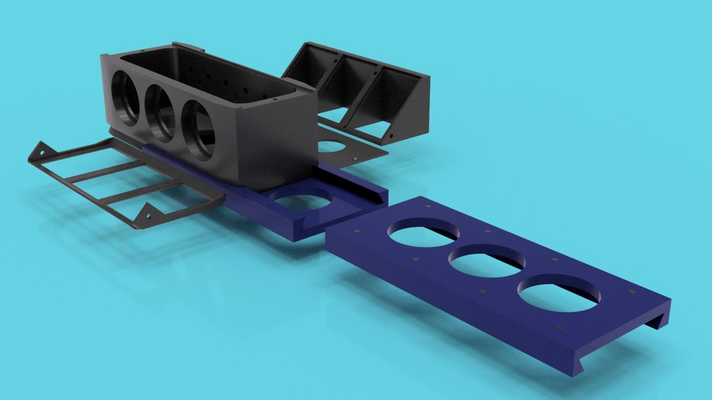

---
title: Image Gallery
date: 2026-06-15
type: landing

sections:
  - block: markdown
    content:
      title: Biophotonics Gallery
      text: |
        A collection of microscopy images, experimental setups,
        optical systems, and research highlights from our lab.

        

          

            
            
<em>Fluorescence microscopy</em>

          

          

            
            
<em>Optical setup</em>

          

          

            
            
<em>Cell imaging experiment</em>

          

        

          

            
            
<em>Cell imaging experimentd</em>

          

        

          

            
            
<em>Cells</em>

          

        

---